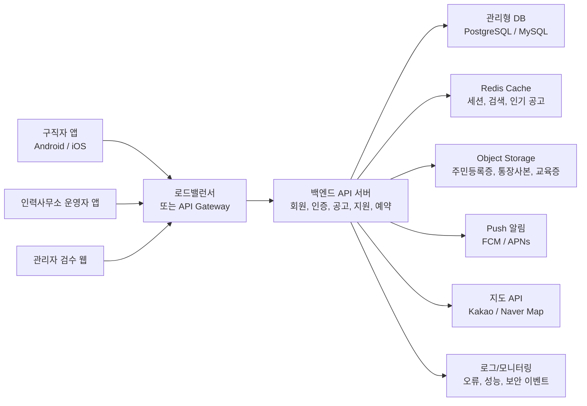
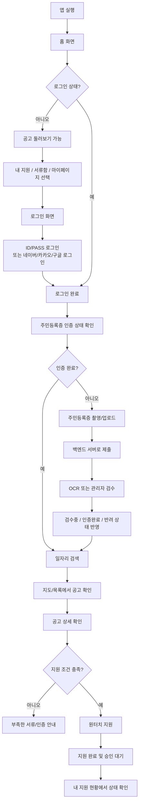
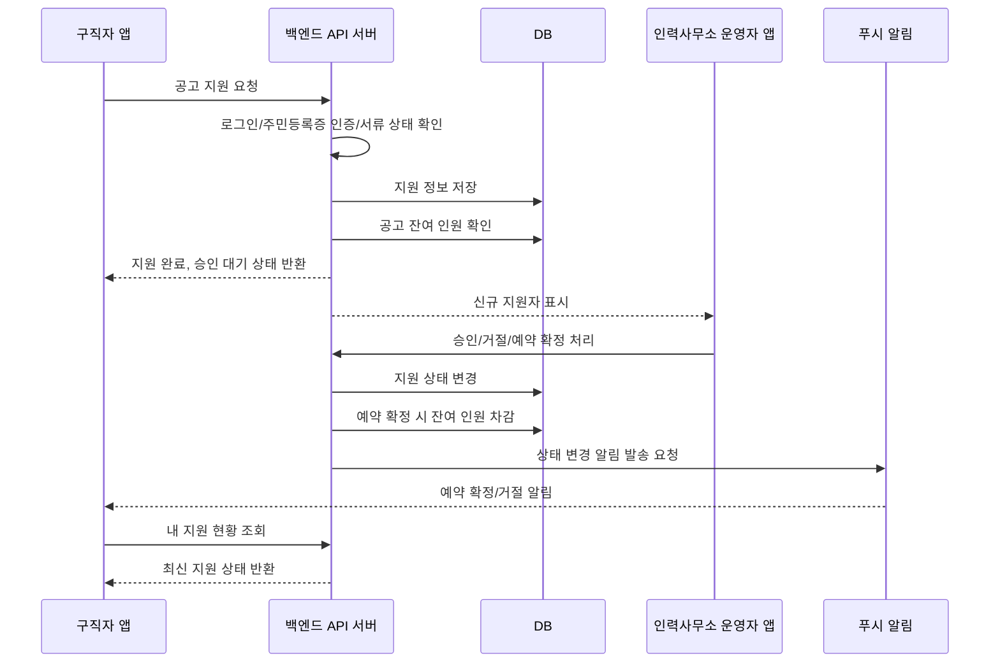
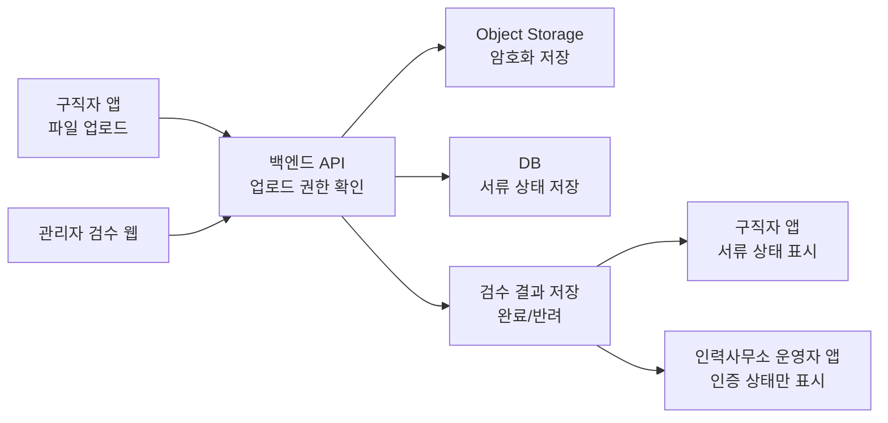

# 구직자용 앱 개발 계획서

## 1. 개발 목표

구직자용 앱은 현장 일자리를 찾는 개인 사용자가 현재 위치 또는 원하는 지역의 인력사무소 구인 정보를 확인하고, 복잡한 전화 문의 없이 빠르게 지원·예약·출근할 수 있도록 돕는 모바일 앱이다.

이번 1차 MVP의 핵심은 다음 흐름을 완성하는 것이다.

> 회원가입 → 주민등록증 인증 → 기본 프로필/서류 등록 → 지역 일자리 검색 → 공고 상세 확인 → 원터치 지원 → 예약 확정 확인 → 출근/이력 관리

회의 결과에 따라 가입 시 개인 인증은 휴대폰 본인인증이 아니라 `주민등록증 인증`만 사용한다. 휴대폰 번호는 연락 및 알림 수신 정보로 수집하되, 개인 인증 수단은 주민등록증 확인으로 한정한다.

주의: 주민등록증에는 주민등록번호 같은 고유식별정보가 포함될 수 있으므로, 보안/개인정보 정책은 개발 초기부터 확정한다. 개인정보보호위원회 자료와 개인정보 보호법상 주민등록번호 처리 제한 조항을 참고하되, 실제 출시 전 법무/개인정보 전문가 검토를 진행한다.

## 2. MVP 핵심 범위

### 포함 기능

- 구직자 회원가입/로그인
- 주민등록증 촬영 또는 이미지 업로드 기반 개인 인증
- 인증 상태: 미제출, 검수중, 인증완료, 반려
- 기본 프로필 등록: 이름, 생년월일, 성별, 연락처, 거주 지역, 희망 근무 지역
- 직무/경력 정보 등록: 희망 직무, 가능 업무, 경력, 보유 자격
- 필수 서류 등록: 통장사본, 건설기초안전교육 이수증, 건강검진일
- 위치 기반 일자리 검색: 현재 위치, 지역 검색, 지도/목록
- 공고 상세 확인: 근무일, 현장 위치, 직무, 모집 인원, 일당, 집결 시간, 조건
- 원터치 지원
- 내 지원/예약 현황
- 예약 확정/거절/마감 알림
- 인력사무소 전화 연결
- 신뢰/출근 이력 확인
- 서류/자격 완료 상태 확인
- 기본 고객센터/문의

### 1차 MVP 제외 기능

- 휴대폰 본인인증
- 채팅
- 급여 이체/정산
- 전자근로계약
- AI 추천
- 커뮤니티
- 다국어 전체 지원
- QR/GPS 출근 인증
- 복잡한 현장 사장님 평가 기능

## 3. 주민등록증 인증 정책

주민등록증은 주민등록번호 등 고유식별정보가 포함될 수 있어 가장 높은 수준의 개인정보 보호 설계가 필요하다.

### 권장 인증 방식

1. 사용자가 앱에서 주민등록증을 촬영하거나 이미지를 업로드한다.
2. 앱은 촬영 가이드와 흐림/잘림 여부를 확인한다.
3. 서버는 OCR 또는 운영자 검수를 통해 이름, 생년월일, 성별, 발급기관 등 필요한 항목만 확인한다.
4. 인증 완료 후 앱에는 `인증완료` 상태만 표시한다.
5. 원본 이미지는 장기 보관하지 않는 것을 기본 원칙으로 한다.
6. 보관이 꼭 필요한 경우 법적 근거와 보관 기간을 명확히 정하고, 원본 접근 권한을 최소화한다.

### 개인정보 최소화 원칙

- 앱 화면에는 주민등록번호 전체를 노출하지 않는다.
- 주민등록번호 뒷자리는 저장하지 않거나, 저장이 필요한 경우 즉시 마스킹한다.
- 인력사무소 운영자에게는 주민등록증 원본이 아니라 인증 상태와 필요한 최소 정보만 제공한다.
- 지원 시 인력사무소에 전달되는 정보는 이름, 나이대, 연락처, 직무, 서류 완료 여부 중심으로 제한한다.
- 관리자 열람 이력, 다운로드 이력, 반려 처리 이력을 모두 남긴다.

### 인증 반려 사유

- 이미지가 흐릿함
- 신분증 일부가 잘림
- 위조 의심
- 이름/생년월일 판독 불가
- 본인 정보와 입력 정보 불일치
- 유효하지 않은 신분증 제출

## 4. 사용자 흐름

### 신규 가입 흐름

1. 앱 실행
2. 약관 및 개인정보 수집 동의
3. 계정 생성
4. 주민등록증 촬영/업로드
5. 기본 프로필 입력
6. 희망 직무/지역 선택
7. 통장사본, 교육 이수증, 건강검진일 등록
8. 가입 완료
9. 인증 검수중 상태로 일자리 검색 가능
10. 인증완료 후 공고 지원 가능

### 일자리 지원 흐름

1. 현재 위치 또는 지역 검색
2. 주변 인력사무소/공고 목록 확인
3. 공고 상세 확인
4. 지원 조건 확인
5. 원터치 지원
6. 지원 완료
7. 인력사무소 승인 대기
8. 예약 확정 또는 거절 알림 수신
9. 출근 예정 화면 확인

### 출근 이후 흐름

1. 출근 예정 알림 확인
2. 인력사무소 또는 현장 안내에 따라 출근
3. 출근 완료/결근/노쇼 상태 반영
4. 근무 평가 반영
5. 내 신뢰 이력과 출근 이력 확인

## 5. 화면 구성

| 화면 | 주요 기능 |
|---|---|
| 온보딩 | 서비스 소개, 약관 동의 |
| 회원가입 | 계정 생성, 기본 연락처 입력 |
| 주민등록증 인증 | 촬영/업로드, 제출 상태, 반려 사유 |
| 프로필 | 기본 정보, 희망 지역, 희망 직무, 경력 |
| 서류함 | 통장사본, 교육 이수증, 건강검진일, 서류 상태 |
| 홈 | 주변 일자리, 오늘 모집, 빠른 지원 |
| 지도 검색 | 현재 위치, 지역 검색, 인력사무소/공고 핀 |
| 공고 목록 | 날짜, 직무, 일당, 거리, 조건 필터 |
| 공고 상세 | 현장 정보, 모집 조건, 인력사무소 정보, 지원 버튼 |
| 지원 완료 | 제출 정보, 지원 상태, 전화 연결 |
| 내 지원 | 승인 대기, 예약 확정, 거절, 취소 이력 |
| 출근 예정 | 근무일, 집결 시간, 연락처, 준비물 |
| 내 신뢰 이력 | 출근 이력, 노쇼 기록, 평가 요약 |
| 알림함 | 예약 확정, 반려, 마감, 출근 전 안내 |
| 고객센터 | 문의, 신고, 자주 묻는 질문 |

## 6. 구현 블럭 설계

| 블럭 | 구현 영역 | 주요 기능 | 우선순위 |
|---|---|---|---|
| A1 | 계정/가입 | 계정 생성, 로그인, 약관 동의, 세션 관리 | P0 |
| A2 | 주민등록증 인증 | 신분증 촬영/업로드, OCR/검수, 인증 상태, 반려 사유 | P0 |
| A3 | 구직자 프로필 | 기본 정보, 희망 지역/직무, 경력, 연락처 | P0 |
| A4 | 서류/자격 관리 | 통장사본, 교육 이수증, 건강검진일, 완료 상태 | P0 |
| A5 | 일자리 검색 | 위치 기반 목록, 지도, 지역/직무/날짜 필터 | P0 |
| A6 | 공고 상세 | 근무 조건, 인력사무소 정보, 필수 서류, 전화 연결 | P0 |
| A7 | 지원/예약 | 원터치 지원, 지원 상태, 예약 확정/거절 | P0 |
| A8 | 내 지원/출근 | 예약 목록, 출근 예정, 취소/거절 이력 | P0 |
| A9 | 알림 | 예약 확정, 반려, 마감, 출근 전 안내 | P1 |
| A10 | 신뢰 이력 | 출근 이력, 노쇼, 평가 요약, 이용 제한 안내 | P1 |
| A11 | 고객센터 | 문의, 신고, FAQ | P2 |
| A12 | 보안/개인정보 | 마스킹, 암호화, 접근 로그, 원본 삭제 정책 | P0 |

## 7. 주요 기능 상세

### A1. 계정/가입

- 이메일 또는 소셜 로그인 중 하나를 선택한다.
- 휴대폰 번호는 연락처 정보로 등록한다.
- 휴대폰 본인인증은 1차 MVP에서 제외한다.
- 약관, 개인정보 수집 동의, 위치정보 동의를 분리한다.
- 필수 동의 없이는 가입을 완료할 수 없다.

### A2. 주민등록증 인증

- 카메라 촬영 및 갤러리 업로드를 제공한다.
- 촬영 가이드: 빛 반사 없음, 네 모서리 포함, 흔들림 없음.
- 인증 제출 후 상태는 `검수중`으로 표시한다.
- 인증 완료 전에는 공고 열람은 가능하되 지원은 제한하는 것을 권장한다.
- 인증 완료 시 지원 기능이 활성화된다.
- 반려 시 사유와 재제출 버튼을 제공한다.

### A3. 구직자 프로필

- 이름과 생년월일은 주민등록증 인증 정보와 연결한다.
- 사용자가 수정 가능한 정보와 인증 정보는 분리한다.
- 희망 근무 지역은 복수 선택을 지원한다.
- 희망 직무는 건설 청소, 조공, 배관 조공, 목수, 유도원, 주방 보조 등으로 시작한다.
- 경력은 간단한 선택형으로 시작한다: 초보, 1년 미만, 1~3년, 3년 이상.

### A4. 서류/자격 관리

- 통장사본: 급여 지급용 계좌 확인
- 건설기초안전교육 이수증: 건설 현장 지원 조건 확인
- 건강검진일: 현장 조건 충족 확인
- 서류별 상태: 미등록, 검수중, 완료, 반려
- 공고 지원 전 부족한 서류가 있으면 경고를 표시한다.

### A5. 일자리 검색

- 홈 화면에는 오늘/내일 모집 공고를 우선 노출한다.
- 지도 화면에서는 현재 위치 기준 주변 인력사무소와 공고를 표시한다.
- 목록 화면에서는 거리, 일당, 직무, 날짜, 외국인 가능 여부 등으로 필터링한다.
- 검색 결과는 구직자가 빠르게 판단할 수 있도록 직무, 일당, 거리, 모집 인원, 마감 임박 여부를 먼저 보여준다.

### A6. 공고 상세

- 근무일
- 현장명 또는 근무 지역
- 직무
- 모집 인원 및 잔여 인원
- 일당
- 집결 시간
- 식사/차량 지원 여부
- 내국인/외국인 가능 여부
- 필수 서류/자격
- 인력사무소 상호, 전화번호, 주소
- 지원 가능/불가 사유

### A7. 지원/예약

- 지원 버튼 클릭 시 등록된 기본 정보와 서류 상태가 자동 제출된다.
- 사용자는 제출 전 정보 요약을 확인한다.
- 지원 상태는 승인 대기, 예약 확정, 거절, 마감, 취소로 구분한다.
- 예약 확정 후에는 출근 예정 화면에 자동 등록된다.
- 이미 같은 시간대에 예약된 공고가 있으면 중복 지원 경고를 표시한다.

### A8. 내 지원/출근

- 오늘 출근 예정
- 승인 대기
- 예약 확정
- 거절/마감
- 과거 근무 이력
- 인력사무소 전화 연결
- 준비물 및 집결 시간 확인

### A9. 알림

- 주민등록증 인증 완료/반려
- 서류 검수 완료/반려
- 지원 완료
- 예약 확정
- 예약 거절
- 모집 마감
- 출근 전 안내
- 노쇼 경고

### A10. 신뢰 이력

- 출근 완료 횟수
- 무단결근/노쇼 횟수
- 좋은 평가 요약
- 주의 이력
- 이용 제한 여부

초기에는 점수를 직접적으로 강하게 노출하기보다, 사용자가 이해하기 쉬운 상태 중심으로 표현한다.

예시:

- 정상 이용 가능
- 좋은 평가가 많아요
- 노쇼 기록이 있어 주의가 필요해요
- 일정 기간 지원이 제한될 수 있어요

## 8. 데이터 설계 초안

| 데이터 | 주요 항목 |
|---|---|
| User | id, account_id, name, birth_date, gender, phone, status |
| IdentityVerification | user_id, status, submitted_at, verified_at, reject_reason, reviewer_id |
| IdentityDocument | user_id, file_id, masked_file_id, delete_status, retention_until |
| WorkerProfile | user_id, regions, job_categories, experience_level, introduction |
| WorkerDocument | user_id, type, status, file_id, reject_reason, verified_at |
| JobPost | office_id, date, site, role, pay, headcount, remaining_count, conditions |
| Application | user_id, job_post_id, status, submitted_at, confirmed_at, cancelled_at |
| AttendanceHistory | user_id, job_post_id, status, recorded_at |
| WorkerReviewSummary | user_id, good_tags, caution_tags, noshow_count, reliability_status |
| Notification | user_id, type, title, body, read_at |
| AuditLog | actor_id, target_type, action, ip, created_at |

## 9. API 설계 초안

| API | 설명 |
|---|---|
| POST /auth/signup | 구직자 계정 생성 |
| POST /auth/login | 로그인 |
| POST /identity/id-card | 주민등록증 이미지 제출 |
| GET /identity/status | 주민등록증 인증 상태 조회 |
| PATCH /profile | 구직자 프로필 수정 |
| POST /documents | 통장사본/교육증 등 서류 업로드 |
| GET /documents | 내 서류 상태 조회 |
| GET /jobs | 공고 목록 조회 |
| GET /jobs/{id} | 공고 상세 조회 |
| POST /jobs/{id}/apply | 공고 지원 |
| GET /applications | 내 지원/예약 목록 |
| PATCH /applications/{id}/cancel | 지원/예약 취소 |
| GET /attendance | 출근 이력 조회 |
| GET /reliability | 신뢰 이력 조회 |
| GET /notifications | 알림 목록 |
| PATCH /notifications/{id}/read | 알림 읽음 처리 |

## 10. 권장 기술 구성

| 영역 | 제안 |
|---|---|
| 모바일 앱 | Flutter 또는 React Native |
| 지원 플랫폼 | Android, iOS |
| 백엔드 API | NestJS 또는 Spring Boot |
| 백엔드 실행 환경 | 클라우드 서버, 컨테이너, Auto Scaling |
| DB | 관리형 PostgreSQL 또는 MySQL |
| 캐시 | Redis |
| 파일 저장 | S3 호환 Object Storage |
| 지도 | Kakao Map 또는 Naver Map |
| 알림 | FCM, APNs |
| 이미지 처리 | 신분증 촬영 품질 검사, OCR 연동 또는 운영자 검수 |
| 보안 | HTTPS, 파일 암호화, 개인정보 마스킹, 접근 로그, 원본 삭제 배치 |
| 모니터링 | 서버/DB/알림/오류 로그 모니터링 |

### 10-1. 전체 기술 구조

구직자 앱의 백엔드는 핸드폰 안에서 동작하지 않는다. 핸드폰에는 Android/iOS 앱만 설치되고, 회원 정보, 주민등록증 인증 상태, 공고, 지원, 예약, 알림, 파일 저장은 클라우드 백엔드 서버에서 처리한다.

### 10-2. 구직자 앱 주요 동작 흐름

구직자 앱의 기본 사용 흐름은 로그인 여부와 주민등록증 인증 상태에 따라 달라진다. 비로그인 사용자는 홈과 공고 검색 일부를 둘러볼 수 있으나, 내 지원, 서류함, 마이페이지, 원터치 지원은 로그인 후 이용하도록 설계한다.

### 10-3. 지원 이후 예약 처리 흐름

구직자가 공고에 지원하면 백엔드 서버는 지원 정보를 저장하고, 인력사무소 운영자 앱에 신규 지원자를 표시한다. 운영자가 승인, 거절, 예약 확정을 처리하면 백엔드는 지원 상태를 변경하고 구직자 앱으로 푸시 알림을 보낸다.

### 10-4. 주요 데이터 이동 흐름

주민등록증, 통장사본, 교육 이수증 같은 민감 파일은 구직자 앱에서 인력사무소 운영자 앱으로 직접 전달하지 않는다. 파일은 백엔드와 Object Storage를 통해 통제하고, 인력사무소에는 원본 이미지가 아니라 인증 상태와 필요한 최소 정보만 제공하는 것을 원칙으로 한다.

### 10-5. 백엔드 서버 역할

백엔드 서버는 구직자 앱과 인력사무소 운영자 앱 사이에서 모든 핵심 데이터를 처리하는 중앙 시스템이다. 사용자가 1만 명 이상으로 늘어날 경우 일반 PC를 서버로 사용하는 것은 적합하지 않으며, 클라우드 기반의 확장 가능한 서버 구조가 필요하다.

백엔드 서버의 주요 역할은 다음과 같다.

- 회원가입, 로그인, 세션/토큰 관리
- 주민등록증 인증 제출, 검수 상태, 반려 사유 관리
- 구직자 프로필, 희망 지역, 희망 직무, 경력 정보 관리
- 통장사본, 건설기초안전교육 이수증, 건강검진일 관리
- 인력사무소 공고 목록과 상세 정보 제공
- 원터치 지원, 예약 확정, 거절, 취소 상태 관리
- 인력사무소 운영자 앱과 지원자 데이터 공유
- 출근 이력, 노쇼 이력, 평가 요약 관리
- 푸시 알림 발송 요청
- 민감 정보 마스킹, 접근 로그, 감사 로그 저장

### 10-6. 1만 명 이상 사용자를 고려한 서버 구성

사용자 수 1만 명은 반드시 서버 1만 대를 의미하지 않는다. 실제 설계에서는 전체 가입자 수보다 `동시 접속자 수`, `피크 시간 요청량`, `이미지 업로드량`, `공고 검색량`이 더 중요하다.

초기 산정 예시는 다음과 같다.

| 항목 | 가정 |
|---|---:|
| 전체 가입자 | 10,000명 이상 |
| 일간 활성 사용자 | 2,000~3,000명 |
| 동시 접속자 | 100~500명 |
| 피크 요청량 | 50~200 req/sec |
| 주요 피크 시간 | 새벽/아침 출근 전, 오후 공고 등록 시간 |

이 정도 규모는 클라우드의 관리형 서버, 관리형 DB, Object Storage, Redis Cache를 사용하면 안정적으로 대응할 수 있다.

### 10-7. 권장 클라우드 아키텍처

1차 런칭에서는 과도한 Kubernetes 구조보다 `관리형 클라우드 서버 + Auto Scaling + 관리형 DB` 조합을 권장한다.

| 구성 요소 | 권장 방식 | 이유 |
|---|---|---|
| 로드밸런서 | Cloud Load Balancer 또는 API Gateway | 여러 API 서버로 트래픽 분산 |
| API 서버 | 컨테이너 기반 NestJS/Spring Boot 서버 2대 이상 | 장애 시 다른 서버가 처리 가능 |
| 자동 확장 | CPU, 메모리, 요청 수 기준 Auto Scaling | 출근 전 피크 시간 대응 |
| DB | 관리형 PostgreSQL/MySQL, 고가용성 구성 | 백업, 장애 조치, 운영 부담 감소 |
| 파일 저장 | Object Storage | 신분증/통장사본/교육증 같은 파일 저장에 적합 |
| 캐시 | Redis | 인기 공고, 검색 결과, 세션, 임시 토큰 처리 |
| 알림 | FCM, APNs | Android/iOS 푸시 알림 |
| 모니터링 | 서버 로그, 오류 추적, DB 지표, 알림 실패율 | 장애 조기 발견 |

### 10-8. 백엔드 서버 세부 모듈

백엔드는 기능별로 모듈을 나누어 개발한다. 처음부터 마이크로서비스로 쪼개기보다, 하나의 백엔드 프로젝트 안에서 모듈 경계를 명확히 두는 모듈형 모놀리스를 권장한다.

| 모듈 | 주요 책임 |
|---|---|
| Auth Module | ID/PASS 로그인, 소셜 로그인, JWT/Refresh Token |
| Identity Module | 주민등록증 제출, 검수 상태, 반려 사유, 원본 삭제 |
| Profile Module | 기본 프로필, 희망 지역, 희망 직무, 경력 |
| Document Module | 통장사본, 교육증, 건강검진일, 서류 상태 |
| Job Module | 공고 목록, 공고 상세, 위치/조건 필터 |
| Application Module | 원터치 지원, 예약 확정, 거절, 취소 |
| Attendance Module | 출근 이력, 노쇼 이력 |
| Reliability Module | 신뢰 상태, 평가 요약, 이용 제한 안내 |
| Notification Module | 푸시 알림, 알림함, 읽음 처리 |
| Admin Review Module | 주민등록증/서류 관리자 검수 |
| Audit Module | 개인정보 접근 로그, 변경 이력 |

### 10-9. 데이터 저장소 분리

민감 정보와 일반 업무 데이터는 저장 위치와 접근 방식을 분리한다.

| 데이터 유형 | 저장 위치 | 처리 방식 |
|---|---|---|
| 회원/프로필 | DB | 일반 개인정보 암호화 또는 컬럼 단위 보호 |
| 주민등록증 원본 | Object Storage | 암호화 저장, 제한 접근, 검수 후 삭제 원칙 |
| 주민등록증 인증 결과 | DB | 원본 대신 인증 상태만 저장 |
| 통장사본/교육증 | Object Storage | 암호화 저장, 접근 로그 기록 |
| 공고/지원/예약 | DB | 트랜잭션 기반 정합성 보장 |
| 인기 공고/검색 캐시 | Redis | 짧은 TTL로 임시 저장 |
| 알림 이력 | DB | 발송 상태, 읽음 상태 저장 |
| 감사 로그 | DB 또는 로그 저장소 | 관리자 열람/다운로드/수정 이력 보관 |

### 10-10. 대용량 처리와 성능 전략

- 공고 목록은 페이지네이션 또는 무한 스크롤을 사용한다.
- 위치 기반 검색은 지역 코드, 좌표, 반경 기준 인덱스를 설계한다.
- 인기 지역과 오늘 공고는 Redis에 캐시한다.
- 주민등록증, 통장사본 같은 이미지 업로드는 앱에서 백엔드로 직접 보내기보다, 백엔드가 임시 업로드 URL을 발급하고 Object Storage에 업로드하는 구조를 검토한다.
- 예약 확정 시 모집 잔여 인원은 DB 트랜잭션으로 처리하여 중복 예약을 방지한다.
- 푸시 알림은 즉시 API 안에서 모두 처리하지 않고, Queue 기반 비동기 처리로 분리하는 것을 권장한다.
- 이미지 원본 삭제, 알림 재시도, 만료 서류 체크는 배치 작업으로 처리한다.

### 10-11. 장애 대응과 확장 전략

| 상황 | 대응 |
|---|---|
| API 서버 1대 장애 | 로드밸런서가 정상 서버로 트래픽 우회 |
| 갑작스러운 접속 증가 | Auto Scaling으로 API 서버 증설 |
| DB 장애 | 관리형 DB 고가용성/Failover 사용 |
| 파일 저장 장애 | Object Storage 내구성 및 백업 정책 사용 |
| 알림 발송 실패 | 알림 Queue와 재시도 정책 적용 |
| 특정 API 지연 | 모니터링 알림, 슬로우 쿼리 분석, 캐시 적용 |

### 10-12. 추천 도입 단계

| 단계 | 서버 구성 | 설명 |
|---|---|---|
| 개발/Mock-up | 로컬 서버 또는 단일 개발 서버 | UI/UX 확인, 내부 테스트 |
| 파일럿 | 클라우드 API 서버 1~2대, 관리형 DB, Object Storage | 실제 인력사무소/구직자 소규모 테스트 |
| 1차 런칭 | API 서버 2대 이상, 로드밸런서, Auto Scaling, 관리형 DB HA, Redis | 사용자 1만 명 이상 대응 |
| 고도화 | Queue, Read Replica, 검색 엔진, Kubernetes 검토 | 지역 확장, 대규모 트래픽 대응 |

### 10-13. 클라우드 후보

| 후보 | 장점 | 비고 |
|---|---|---|
| AWS 서울 리전 | Auto Scaling, RDS, S3, CloudWatch 등 성숙한 생태계 | 대규모 확장과 운영 자동화에 강함 |
| NAVER Cloud | 국내 서비스 친화적, Cloud DB/Object Storage 제공 | 국내 지도/공공/국내 운영 환경과 궁합이 좋음 |
| KakaoCloud | Kubernetes Engine, 국내 클라우드 옵션 | 컨테이너 기반 운영 시 검토 가능 |
| Firebase/Supabase | 빠른 MVP 개발 | 주민등록증 검수, 복잡한 권한, 운영자 앱 연동이 커지면 한계 검토 필요 |

1차 상용 서비스를 목표로 할 경우, `AWS 또는 NAVER Cloud + 관리형 PostgreSQL + Object Storage + Redis + Push 알림` 구성을 우선 검토하는 것이 현실적이다.

## 11. 개발 스케줄 제안

기준: 2026년 5월 11일 착수
권장 기간: 개발 및 QA 16주, 파일럿/런칭 포함 20주, 안정화 포함 22주

| 단계 | 기간 | 일정 | 주요 작업 | 완료 기준 |
|---|---:|---|---|---|
| 1. 요구사항 확정 | 1주 | 2026-05-11 ~ 2026-05-15 | MVP 범위 확정, 주민등록증 인증 정책, 개인정보 보관 정책 | 기능 목록 및 보안 정책 확정 |
| 2. UX/UI 설계 | 2주 | 2026-05-18 ~ 2026-05-29 | 온보딩, 신분증 인증, 홈, 검색, 공고 상세, 지원, 내 지원 화면 | 주요 화면 설계 완료 |
| 3. 기술 설계/환경 구축 | 2주 | 2026-05-18 ~ 2026-05-29 | 앱 구조, 백엔드 서버 구조, API, DB, 파일 저장, 알림, 지도, Auto Scaling 설계 | ERD/API/클라우드 개발 환경 완료 |
| 4. Sprint 1: 가입/주민등록증 인증 | 3주 | 2026-06-01 ~ 2026-06-19 | 가입, 로그인, 약관, 주민등록증 제출, 인증 상태, 반려 처리 | 인증 제출 및 상태 조회 가능 |
| 5. Sprint 2: 프로필/서류함 | 3주 | 2026-06-22 ~ 2026-07-10 | 기본 프로필, 희망 지역/직무, 통장사본, 교육증, 건강검진일 | 지원 전 정보 등록 완료 |
| 6. Sprint 3: 일자리 검색/공고 상세 | 3주 | 2026-07-13 ~ 2026-07-31 | 홈, 지도, 목록, 필터, 공고 상세, 전화 연결 | 공고 탐색 및 상세 확인 가능 |
| 7. Sprint 4: 지원/예약/내 지원 | 3주 | 2026-08-03 ~ 2026-08-21 | 원터치 지원, 지원 상태, 예약 확정, 취소, 내 지원 화면 | 지원부터 예약 확인까지 가능 |
| 8. Sprint 5: 알림/신뢰 이력 | 2주 | 2026-08-24 ~ 2026-09-04 | 푸시 알림, 알림함, 출근 이력, 노쇼/평가 요약 | 예약/검수/출근 알림 가능 |
| 9. 통합 QA/보안 점검 | 2주 | 2026-09-07 ~ 2026-09-18 | 앱 통합 테스트, 권한, 문서 접근, 마스킹, 원본 삭제 테스트 | 파일럿 후보 빌드 |
| 10. 파일럿 운영 | 2주 | 2026-09-21 ~ 2026-10-02 | 실제 구직자/인력사무소 테스트, 공고 지원 흐름 검증 | 현장 피드백 반영 |
| 11. 앱 심사/런칭 준비 | 1주 | 2026-10-05 ~ 2026-10-09 | 스토어 등록, 운영 매뉴얼, 고객센터 준비 | Android/iOS 배포 준비 |
| 12. 정식 런칭 | 1일 | 2026-10-12 | 앱 공개 | 서비스 오픈 |
| 13. 런칭 안정화 | 2주 | 2026-10-12 ~ 2026-10-23 | 오류 수정, 전환율/지원율/예약률 모니터링 | 안정화 리포트 |

## 12. Sprint별 개발 백로그

### Sprint 1: 가입/주민등록증 인증

| ID | 작업 | 우선순위 | 완료 기준 |
|---|---|---|---|
| WKR-001 | 구직자 가입/로그인 | P0 | 계정 생성, 로그인, 로그아웃 가능 |
| WKR-002 | 약관/개인정보/위치 동의 | P0 | 필수 동의 없이는 가입 불가 |
| WKR-003 | 주민등록증 촬영/업로드 | P0 | 카메라 촬영 및 파일 업로드 가능 |
| WKR-004 | 신분증 이미지 품질 검증 | P0 | 흐림/잘림/용량 오류 안내 |
| WKR-005 | 인증 상태 화면 | P0 | 미제출/검수중/완료/반려 표시 |
| WKR-006 | 반려 사유 및 재제출 | P0 | 반려 후 재업로드 가능 |
| WKR-007 | 원본 접근 로그/마스킹 정책 | P0 | 관리자 열람 이력 저장 |

### Sprint 2: 프로필/서류함

| ID | 작업 | 우선순위 | 완료 기준 |
|---|---|---|---|
| WKR-010 | 기본 프로필 등록 | P0 | 이름, 생년월일, 성별, 연락처 저장 |
| WKR-011 | 희망 지역/직무 선택 | P0 | 복수 지역/직무 선택 가능 |
| WKR-012 | 경력 정보 등록 | P0 | 직무별 경력 수준 저장 |
| WKR-013 | 통장사본 업로드 | P0 | 업로드 및 상태 확인 가능 |
| WKR-014 | 건설기초안전교육 이수증 업로드 | P0 | 업로드 및 검수 상태 확인 가능 |
| WKR-015 | 건강검진일 등록 | P1 | 날짜 등록 및 만료 안내 가능 |
| WKR-016 | 서류 완료 상태 요약 | P0 | 지원 가능/불가 사유 표시 |

### Sprint 3: 일자리 검색/공고 상세

| ID | 작업 | 우선순위 | 완료 기준 |
|---|---|---|---|
| WKR-020 | 홈 화면 | P0 | 주변/오늘/마감임박 공고 노출 |
| WKR-021 | 위치 권한 처리 | P0 | 권한 허용/거부 상태별 UI |
| WKR-022 | 지도 검색 | P0 | 현재 위치 기준 공고/인력사무소 표시 |
| WKR-023 | 공고 목록 | P0 | 날짜, 직무, 거리, 일당 표시 |
| WKR-024 | 필터/검색 | P0 | 지역, 직무, 날짜 필터 적용 |
| WKR-025 | 공고 상세 | P0 | 근무 조건과 필수 서류 표시 |
| WKR-026 | 인력사무소 전화 연결 | P0 | 상세 화면에서 전화 연결 가능 |

### Sprint 4: 지원/예약/내 지원

| ID | 작업 | 우선순위 | 완료 기준 |
|---|---|---|---|
| WKR-030 | 원터치 지원 | P0 | 인증 완료 사용자가 공고 지원 가능 |
| WKR-031 | 제출 정보 확인 | P0 | 지원 전 제출 정보 요약 표시 |
| WKR-032 | 지원 상태 관리 | P0 | 승인 대기/예약 확정/거절/마감 표시 |
| WKR-033 | 중복 지원 방지 | P0 | 같은 시간대 예약 충돌 안내 |
| WKR-034 | 내 지원 목록 | P0 | 상태별 지원 이력 확인 가능 |
| WKR-035 | 출근 예정 화면 | P0 | 집결 시간, 연락처, 준비물 표시 |
| WKR-036 | 지원/예약 취소 | P1 | 정책에 따른 취소 가능 |

### Sprint 5: 알림/신뢰 이력

| ID | 작업 | 우선순위 | 완료 기준 |
|---|---|---|---|
| WKR-040 | 푸시 알림 연동 | P1 | Android/iOS 알림 수신 가능 |
| WKR-041 | 알림함 | P1 | 예약, 반려, 출근 안내 알림 표시 |
| WKR-042 | 출근 이력 | P1 | 과거 근무 이력 조회 가능 |
| WKR-043 | 노쇼/주의 이력 | P1 | 사용자에게 주의 상태 표시 |
| WKR-044 | 평가 요약 | P1 | 좋은 평가/주의 태그 요약 |
| WKR-045 | 이용 제한 안내 | P1 | 제한 사유와 기간 안내 |

## 13. 운영자/인력사무소 앱과의 연동 포인트

| 구직자 앱 | 인력사무소 운영자 앱 |
|---|---|
| 공고 조회 | 공고 등록/수정/마감 |
| 공고 지원 | 지원자 목록 수신 |
| 예약 확정 확인 | 지원 승인/거절/예약 확정 |
| 출근 예정 확인 | 출근/노쇼 기록 |
| 신뢰 이력 확인 | 근로자 평가/제재 등록 |
| 서류 상태 표시 | 지원자 서류 상태 확인 |
| 알림 수신 | 상태 변경 알림 발송 |

## 14. 보안 및 개인정보 체크리스트

- 주민등록증 원본 이미지는 장기 보관하지 않는 것을 기본 정책으로 한다.
- 원본 보관이 필요한 경우 보관 목적, 기간, 법적 근거, 접근 권한을 문서화한다.
- 주민등록번호 전체 노출을 금지한다.
- 주민등록번호 뒷자리는 저장하지 않거나 즉시 마스킹한다.
- 모든 신분증 파일은 암호화 저장한다.
- 관리자 열람 시 접근 로그를 남긴다.
- 파일 다운로드는 기본 차단하고, 필요 시 권한 승인 기반으로 제한한다.
- 앱/서버 통신은 HTTPS를 사용한다.
- 앱 내 스크린샷 방지 적용 여부를 검토한다.
- 탈퇴 시 개인정보 및 파일 삭제/보관 정책을 명확히 적용한다.
- 검수 완료/반려 후 원본 삭제 배치를 운영한다.
- 인력사무소에는 신분증 원본 대신 인증 상태와 최소 프로필만 제공한다.

## 15. 런칭 전 필수 검증

- 신규 사용자가 주민등록증 인증을 제출할 수 있다.
- 인증 완료 전/후 지원 가능 상태가 정확히 구분된다.
- 반려 사유와 재제출 흐름이 정상 동작한다.
- 프로필과 필수 서류를 등록할 수 있다.
- 현재 위치와 지역 검색으로 공고를 찾을 수 있다.
- 공고 상세에서 조건과 필수 서류를 확인할 수 있다.
- 원터치 지원이 정상 동작한다.
- 지원 상태가 내 지원 화면에 반영된다.
- 예약 확정 알림이 수신된다.
- 출근 예정 화면에서 집결 시간과 전화 연결을 확인할 수 있다.
- 인력사무소 앱에서 승인/거절한 상태가 구직자 앱에 반영된다.
- 신분증 원본 접근 권한과 마스킹이 정상 동작한다.

## 16. 결론

구직자용 앱의 1차 목표는 많은 기능을 한 번에 넣는 것이 아니라, 실제 현장에서 가장 중요한 “빠른 지원과 신뢰 가능한 배정”을 완성하는 것이다.

따라서 첫 버전은 주민등록증 인증, 프로필/서류 등록, 위치 기반 공고 탐색, 원터치 지원, 예약 확인, 알림, 출근 이력에 집중한다. 이후 사용 데이터가 쌓이면 전자계약, 급여 정산, QR/GPS 출근 인증, AI 추천 기능을 2차 고도화로 확장하는 것이 적절하다.
